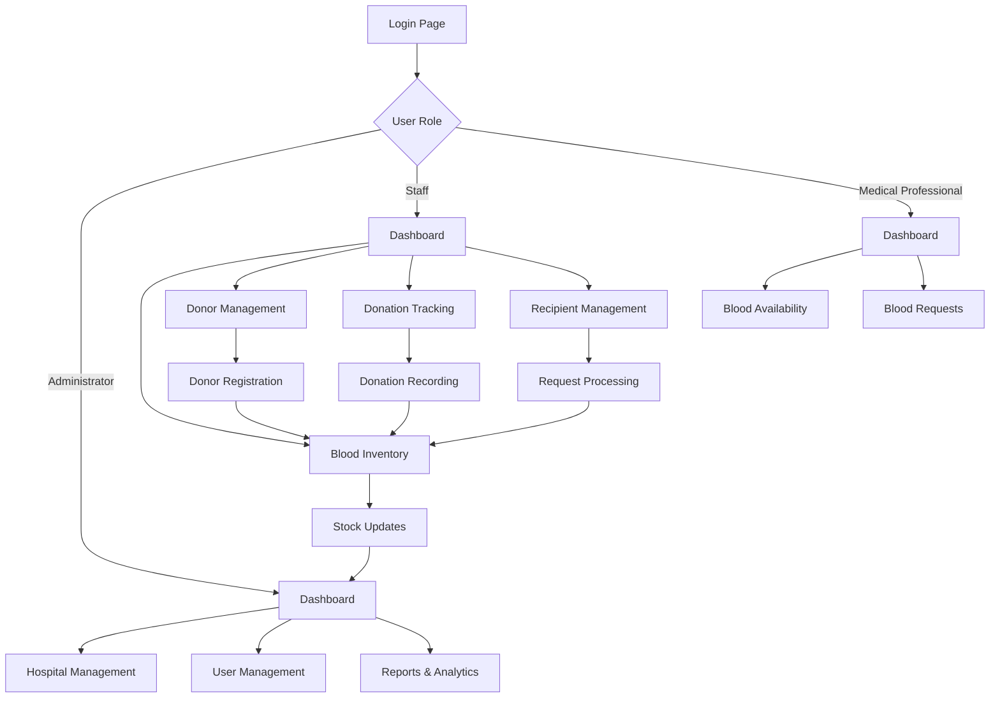

## 1. Product Overview

VienLink is an Indian-based blood bank management platform designed specifically for hospitals to efficiently manage blood inventory, donor relationships, and blood distribution. The platform solves critical healthcare challenges by providing real-time blood stock monitoring, streamlined donor management, and secure blood request processing.

The system helps hospitals maintain adequate blood supplies, track donations, manage donor and recipient information, and ensure compliance with Indian healthcare regulations. Target users include hospital administrators, blood bank staff, and medical professionals who need reliable blood inventory management.

## 2. Core Features

### 2.1 User Roles

| Role | Registration Method | Core Permissions |
|------|---------------------|------------------|
| Hospital Administrator | Google OAuth + Manual Registration | Full system access, user management, blood inventory control |
| Blood Bank Staff | Hospital Administrator Invitation | Manage blood stock, process donations, handle requests |
| Medical Professional | Hospital Administrator Invitation | View blood availability, place blood requests |
| System Admin | Manual Registration | Platform oversight, hospital management |

### 2.2 Feature Module

VienLink consists of the following main pages:

1. **Dashboard**: Real-time blood inventory overview, critical stock alerts, donation statistics
2. **Blood Inventory**: Stock management, blood type categorization, expiration tracking
3. **Donor Management**: Donor registration, medical history, donation records
4. **Recipient Management**: Patient registration, blood requests, compatibility checking
5. **Donation Tracking**: Donation process, stock updates, donor notifications
6. **Hospital Management**: Multi-hospital support, agency model, billing
7. **Reports & Analytics**: Usage reports, compliance reports, trend analysis
8. **User Management**: Staff accounts, role assignments, access control

### 2.3 Page Details

| Page Name | Module Name | Feature description |
|-----------|-------------|---------------------|
| Dashboard | Blood Overview | Display real-time blood stock levels for all blood types with visual indicators |
| Dashboard | Critical Alerts | Show low stock warnings and expiring blood units with priority levels |
| Dashboard | Statistics | Display donation trends, usage patterns, and hospital performance metrics |
| Blood Inventory | Stock Management | Add/remove blood units, update quantities, track expiration dates |
| Blood Inventory | Blood Types | Categorize by A+, A-, B+, B-, AB+, AB-, O+, O- with separate tracking |
| Blood Inventory | Batch Tracking | Track individual blood units with unique IDs and source information |
| Donor Management | Donor Registration | Collect donor information, medical history, contact details |
| Donor Management | Donation History | Track all donations with dates, quantities, and test results |
| Donor Management | Donor Eligibility | Check donor eligibility based on medical criteria and donation intervals |
| Recipient Management | Patient Registration | Register recipients with medical details and blood type requirements |
| Recipient Management | Blood Requests | Process blood requests with urgency levels and approval workflow |
| Recipient Management | Compatibility Check | Verify blood type compatibility before processing requests |
| Donation Tracking | Donation Process | Record donation details, update stock automatically |
| Donation Tracking | Test Results | Record and track blood test results and quality checks |
| Hospital Management | Hospital Profiles | Manage multiple hospital accounts with separate inventories |
| Hospital Management | Agency Model | Support for blood bank agencies selling to multiple hospitals |
| Reports & Analytics | Usage Reports | Generate detailed reports on blood usage and inventory turnover |
| Reports & Analytics | Compliance Reports | Create regulatory compliance reports for health authorities |
| User Management | Staff Accounts | Create and manage user accounts with role-based permissions |
| User Management | Access Control | Define permissions based on user roles and responsibilities |

## 3. Core Process

### Hospital Administrator Flow
Hospital administrators begin by registering their hospital and setting up initial blood inventory. They invite staff members and configure blood type categories. Administrators monitor overall system usage, generate compliance reports, and manage hospital-specific settings.

### Blood Bank Staff Flow
Staff members log in to manage daily operations. They record incoming donations, update blood inventory, process blood requests from medical professionals, and maintain donor records. Staff also handle blood unit expiration tracking and disposal processes.

### Medical Professional Flow
Medical professionals access the system to check blood availability and submit blood requests for patients. They can view request status, receive notifications when blood is allocated, and access patient compatibility information.

### Donor Management Flow
Donors can be registered by staff during donation visits. The system tracks donation history, eligibility status, and sends reminders for eligible donors. Medical screening results are recorded to ensure donation safety.

## 4. User Interface Design

### 4.1 Design Style
- **Primary Colors**: Deep red (#DC2626) for blood theme, white (#FFFFFF) for cleanliness, light gray (#F3F4F6) for backgrounds
- **Secondary Colors**: Blue (#2563EB) for actions, green (#059669) for success, amber (#F59E0B) for warnings
- **Button Style**: Rounded corners with subtle shadows, 3D hover effects using Three.js
- **Typography**: Inter font family with clear hierarchy - 16px base, 24px headings, 14px secondary text
- **Layout**: Card-based design with grid layouts, responsive containers
- **Icons**: Medical-themed icons, blood drop motifs, 3D animated elements for key metrics

### 4.2 Page Design Overview

| Page Name | Module Name | UI Elements |
|-----------|-------------|-------------|
| Dashboard | Blood Overview | 3D animated blood bag icons, real-time counters, color-coded status indicators |
| Dashboard | Critical Alerts | Red gradient cards with pulsing animations, urgent notification badges |
| Blood Inventory | Stock Grid | Interactive 3D grid layout, drag-and-drop functionality, hover effects |
| Donor Management | Donor Cards | Profile cards with 3D rotation, medical status indicators, donation history timeline |
| Donation Tracking | Process Flow | Step-by-step 3D progress bar, animated form transitions, success animations |
| Reports | Analytics Charts | Interactive 3D charts using Three.js, hover data points, animated transitions |

### 4.3 Responsiveness
The system is designed desktop-first with full mobile adaptation. Touch interactions are optimized for tablets used in hospital environments. Critical features remain accessible on mobile devices for emergency situations. 3D elements gracefully degrade to 2D on lower-performance devices.