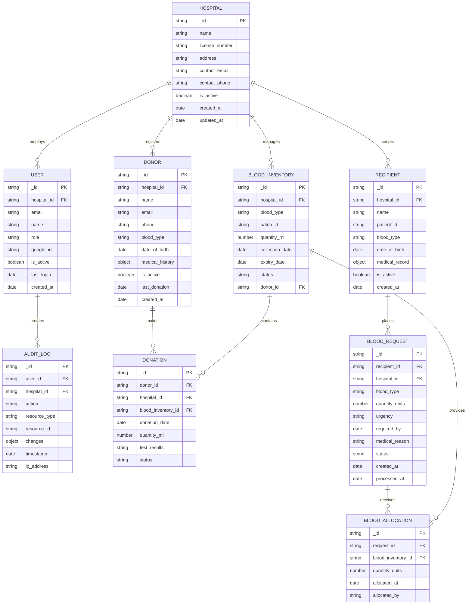

## 1. Architecture Design

```mermaid
graph TD
  A[User Browser] --> B[React Frontend Application]
  B --> C[Express.js Backend API]
  C --> D[MongoDB Atlas Database]
  C --> E[Google OAuth Service]
  C --> F[JWT Token Service]
  
  subgraph "Frontend Layer"
    B[B[React + Vite + TypeScript<br/>shadcn/ui + Three.js + Tailwind]]
  end
  
  subgraph "Backend Layer"
    C[C[Express.js + Node.js<br/>Authentication + Business Logic]]
    F[F[JWT Token Service]]
  end
  
  subgraph "Data Layer"
    D[D[MongoDB Atlas<br/>Cloud Database]]
  end
  
  subgraph "External Services"
    E[E[Google OAuth<br/>Authentication]]
  end
```

## 2. Technology Description

- **Frontend**: React@18 + Vite@4 + TypeScript@5 + shadcn/ui + Three.js + Tailwind CSS@3
- **Backend**: Express.js@4 + Node.js@18 + JWT + Google OAuth
- **Database**: MongoDB Atlas (Cloud MongoDB)
- **State Management**: Zustand@4
- **Build Tool**: Vite@4
- **Package Manager**: npm

## 3. Route Definitions

| Route | Purpose |
|-------|---------|
| / | Login page with Google OAuth integration |
| /dashboard | Main dashboard with blood inventory overview |
| /inventory | Blood stock management and tracking |
| /donors | Donor management and registration |
| /recipients | Recipient management and blood requests |
| /donations | Donation tracking and processing |
| /hospitals | Hospital management and agency features |
| /reports | Analytics and compliance reporting |
| /users | User management and role assignment |
| /settings | System configuration and preferences |

## 4. API Definitions

### 4.1 Authentication APIs

**Google OAuth Login**
```
POST /api/auth/google
```

Request:
```json
{
  "id_token": "google_id_token_string"
}
```

Response:
```json
{
  "token": "jwt_token_string",
  "user": {
    "id": "user_id",
    "email": "user@hospital.com",
    "name": "User Name",
    "role": "administrator|staff|medical_professional",
    "hospital_id": "hospital_id"
  }
}
```

**JWT Token Refresh**
```
POST /api/auth/refresh
```

Request:
```json
{
  "refresh_token": "refresh_token_string"
}
```

### 4.2 Blood Inventory APIs

**Get Blood Inventory**
```
GET /api/inventory
```

Response:
```json
{
  "inventory": [
    {
      "blood_type": "A+",
      "quantity": 150,
      "expiring_soon": 12,
      "critical_level": false
    }
  ],
  "last_updated": "2024-01-15T10:30:00Z"
}
```

**Update Blood Stock**
```
PUT /api/inventory/update
```

Request:
```json
{
  "blood_type": "A+",
  "quantity_change": 25,
  "operation": "add|remove",
  "reason": "donation|request|expired",
  "batch_id": "batch_identifier"
}
```

### 4.3 Donor Management APIs

**Register Donor**
```
POST /api/donors/register
```

Request:
```json
{
  "name": "Donor Name",
  "email": "donor@email.com",
  "phone": "+911234567890",
  "blood_type": "A+",
  "date_of_birth": "1990-01-01",
  "medical_history": {
    "conditions": ["none"],
    "medications": ["none"],
    "last_donation": "2023-12-01"
  }
}
```

**Get Donor History**
```
GET /api/donors/:donor_id/history
```

Response:
```json
{
  "donor_id": "donor_id",
  "donations": [
    {
      "donation_id": "donation_id",
      "date": "2024-01-10",
      "quantity": 350,
      "blood_type": "A+",
      "test_results": "passed"
    }
  ],
  "total_donations": 5,
  "last_donation": "2024-01-10"
}
```

### 4.4 Blood Request APIs

**Create Blood Request**
```
POST /api/requests/create
```

Request:
```json
{
  "recipient_id": "recipient_id",
  "blood_type": "A+",
  "quantity": 2,
  "urgency": "normal|urgent|critical",
  "required_by": "2024-01-16T14:00:00Z",
  "medical_reason": "Surgery - Cardiac procedure"
}
```

**Process Blood Request**
```
PUT /api/requests/:request_id/process
```

Request:
```json
{
  "action": "approve|reject|partial",
  "allocated_units": ["unit_id_1", "unit_id_2"],
  "reason": "Approved for surgery"
}
```

## 5. Server Architecture Diagram

```mermaid
graph TD
  A[Client / Frontend] --> B[Authentication Middleware]
  B --> C[Route Controllers]
  C --> D[Business Logic Layer]
  D --> E[Data Access Layer]
  E --> F[(MongoDB Atlas)]
  
  subgraph "Express.js Server"
    B[B[JWT Validation<br/>Google OAuth Integration]]
    C[C[Inventory Controller<br/>Donor Controller<br/>Request Controller]]
    D[D[Inventory Service<br/>Donor Service<br/>Request Service]]
    E[E[MongoDB Repository<br/>Data Validation<br/>Business Rules]]
  end
```

## 6. Data Model

### 6.1 Data Model Definition



### 6.2 Data Definition Language

**Hospitals Collection**
```javascript
// MongoDB Schema Definition
{
  _id: ObjectId,
  name: { type: String, required: true },
  license_number: { type: String, required: true, unique: true },
  address: {
    street: String,
    city: String,
    state: String,
    pincode: String,
    country: { type: String, default: "India" }
  },
  contact_email: { type: String, required: true },
  contact_phone: { type: String, required: true },
  is_active: { type: Boolean, default: true },
  created_at: { type: Date, default: Date.now },
  updated_at: { type: Date, default: Date.now }
}
```

**Users Collection**
```javascript
{
  _id: ObjectId,
  hospital_id: { type: ObjectId, ref: "Hospital", required: true },
  email: { type: String, required: true, unique: true },
  name: { type: String, required: true },
  role: { type: String, enum: ["administrator", "staff", "medical_professional"], required: true },
  google_id: { type: String, unique: true },
  is_active: { type: Boolean, default: true },
  last_login: Date,
  created_at: { type: Date, default: Date.now },
  updated_at: { type: Date, default: Date.now }
}
```

**Blood Inventory Collection**
```javascript
{
  _id: ObjectId,
  hospital_id: { type: ObjectId, ref: "Hospital", required: true },
  blood_type: { type: String, enum: ["A+", "A-", "B+", "B-", "AB+", "AB-", "O+", "O-"], required: true },
  batch_id: { type: String, required: true },
  quantity_ml: { type: Number, required: true },
  collection_date: { type: Date, required: true },
  expiry_date: { type: Date, required: true },
  status: { type: String, enum: ["available", "allocated", "expired", "disposed"], default: "available" },
  donor_id: { type: ObjectId, ref: "Donor" },
  created_at: { type: Date, default: Date.now }
}
```

**Donors Collection**
```javascript
{
  _id: ObjectId,
  hospital_id: { type: ObjectId, ref: "Hospital", required: true },
  name: { type: String, required: true },
  email: { type: String },
  phone: { type: String, required: true },
  blood_type: { type: String, enum: ["A+", "A-", "B+", "B-", "AB+", "AB-", "O+", "O-"], required: true },
  date_of_birth: { type: Date, required: true },
  medical_history: {
    conditions: [String],
    medications: [String],
    allergies: [String],
    last_donation: Date
  },
  is_active: { type: Boolean, default: true },
  last_donation: Date,
  created_at: { type: Date, default: Date.now },
  updated_at: { type: Date, default: Date.now }
}
```

**Indexes for Performance**
```javascript
// Create indexes for optimal query performance
db.blood_inventory.createIndex({ hospital_id: 1, blood_type: 1, status: 1 })
db.blood_inventory.createIndex({ expiry_date: 1 })
db.donors.createIndex({ hospital_id: 1, blood_type: 1 })
db.blood_requests.createIndex({ hospital_id: 1, status: 1, urgency: 1 })
db.audit_logs.createIndex({ hospital_id: 1, timestamp: -1 })
db.users.createIndex({ email: 1 })
```

## 7. Security & Compliance

### 7.1 HIPAA Compliance
- All patient data encrypted at rest and in transit
- Audit logging for all data access and modifications
- Role-based access control with principle of least privilege
- Data retention policies for medical records
- Secure data backup and recovery procedures

### 7.2 Data Encryption
- TLS 1.3 for all API communications
- AES-256 encryption for sensitive data fields
- Secure key management using environment variables
- Database connection encryption

### 7.3 Access Control
- JWT tokens with 15-minute expiration
- Refresh token rotation
- Multi-factor authentication support
- IP-based access restrictions
- Session management and timeout

### 7.4 Indian Healthcare Regulations
- Compliance with CDSCO (Central Drugs Standard Control Organization) guidelines
- NABL (National Accreditation Board for Testing and Calibration Laboratories) standards
- Data localization requirements for Indian healthcare data
- Blood bank licensing and regulatory compliance